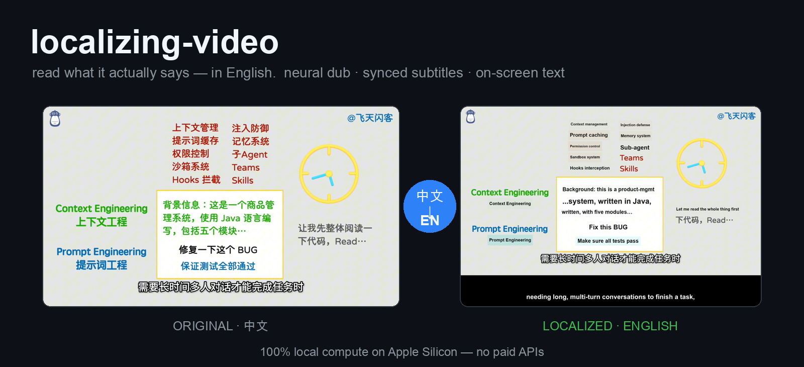
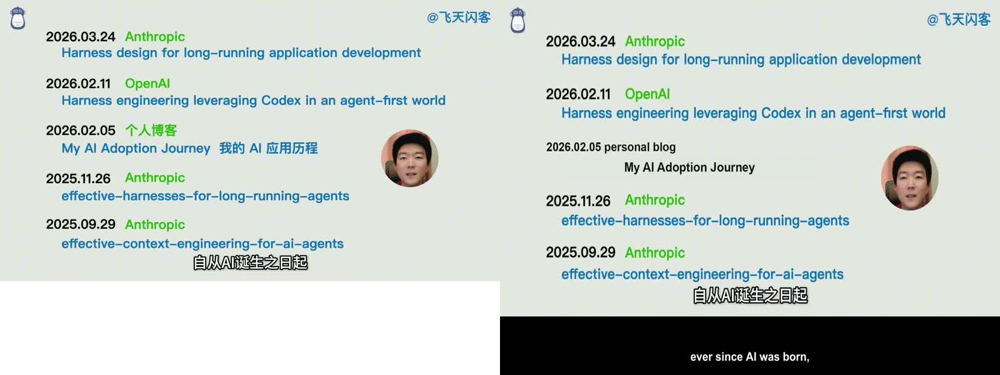

# localizing-video

**Make a foreign-language video say what it actually says — in English — with the dub, the subtitles,
and the on-screen text all translated and in sync. Locally, for free.**

## Why this exists

Ideas move across a language border through a chain of middlemen, and the chain is lossy by
construction. A well-known figure says something; a second language's commentators paraphrase it; the
paraphrase hardens into "the thing everyone now repeats." By the time it reaches you, you're not
reacting to what was said — you're reacting to a summary of a summary, and you can't go check, because
the primary source is in a language you don't read.

This tool removes the border. It takes the artifact whole — the spoken track in full, plus the slides
and the on-screen text — and renders it in your language without dumbing it down. You get the primary
source, not the telephone-game version. You can finally argue with the thing itself.

The two videos this was first built on make the point better than any pitch: both are Mandarin creators
**dismantling** how Western AI buzzwords ("Harness", "Loop Engineering") get laundered — a famous name
says it, influencers parrot it, it becomes a "new paradigm" nobody can define. That critique is sharp,
and it was invisible to English speakers, who only ever got the hype. Localize it, and the deconstruction
crosses the border too. A tool that breaks the language barrier, applied first to videos *about* breaking
the hype barrier. That's the whole idea: **less friction between what someone said and who gets to
understand it.**

## What it produces

Three burned-in layers, in sync, from one foreign-language video:

1. **Dubbed audio** — neural TTS, each segment time-fitted to the original (with drift catch-up, since
   English runs longer); original-language clips left audible underneath where the source itself is English.
2. **English subtitles** — in a letterbox bar, so they never fight the source's own burned-in captions.
3. **On-screen text** — slides, diagrams, screenshots OCR'd, translated, and painted back in place.

100% local compute on Apple Silicon. No paid APIs.

### Another example

*Original Mandarin (left) → dub + subtitle bar + in-place English overlay (right). A different video, same pipeline.*

## How it's built

- **`SKILL.md`** — the skill: the eight-stage workflow, the decision points, and the silent footguns
  that re-derivation gets wrong (Kokoro vs robotic `say`, native-speed resync vs `atempo` artifacts,
  the espeak path fix, ASS `PlayResY` so subtitles land in the bar, Vision OCR via `ocrmac`, scoping
  overlay to genuinely-Chinese-only text).
- **`engine/`** — the generic, reusable pipeline. Operates only on data files; nothing per-video lives
  here. `engine/SETUP.md` to install, `engine/run.sh` to run.
- **`example/`** — one real, complete worked dataset, and the documented per-video step (the *only* part
  that changes between videos: producing `en.srt` and `translations.json`).
- **`demo/`** — the before/after frames above.

## Status

Validated end-to-end on two full videos (8 min and 11.5 min Mandarin commentary). Known weak spot:
heavily stylized hand-drawn on-screen text OCRs inconsistently, so a few such labels can go uncovered;
static slide, screenshot, and document text covers cleanly. macOS / Apple Silicon specific.
